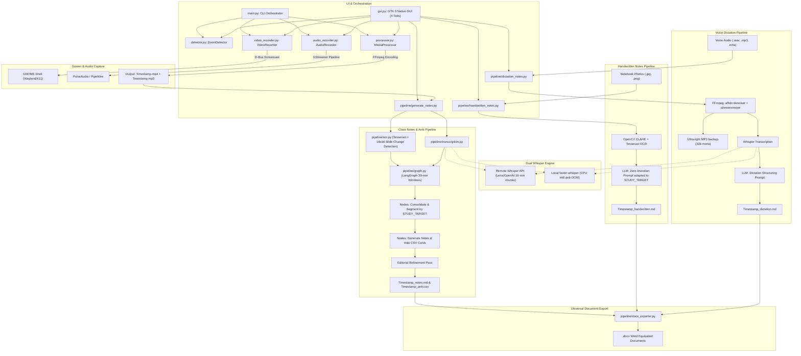

# OmniLecture Studio
### Smart Screen Recorder for Linux (Wayland/GNOME) & Multimodal AI Study Notes, Anki Flashcards, Handwritten Digitization, and Voice Dictation Suite

[](https://www.python.org/)
[](https://www.gnome.org/)
[](https://www.gtk.org/)
[](https://www.langchain.com/langgraph)
[](https://github.com/SYSTRAN/faster-whisper)
[](https://github.com/tesseract-ocr/tesseract)
[](LICENSE)

---

> [!WARNING]
> ### ⚖️ Mandatory Legal Notice & Recording Consent Disclaimer
> **It is MANDATORY by law to expressly inform all participants before recording any video call, teleconference, or virtual meeting.**
>
> In accordance with the General Data Protection Regulation (**GDPR / RGPD**, EU Regulation 2016/679), national privacy legislation, and image/personality rights:
>
> 1. **Prior Notice and Consent**: Before initiating any recording (whether using the manual recording mode or the automatic Zoom meeting detection daemon), you must notify all conversation participants (instructors, speakers, attendees, or colleagues) and obtain their prior consent where legally required.
> 2. **Exclusive Personal Study and Private Use**: Any audiovisual recordings, extracted audio, and AI-generated notes must be used solely for private, non-commercial educational purposes by the individual user. Public redistribution, social media broadcasting, or sharing with unauthorized third parties without the explicit consent of copyright and data owners is strictly prohibited.
> 3. **Disclaimer of Liability**: This software provides technical capture and local processing tools. All ethical, civil, and criminal liability arising from recording without required notifications, privacy infringements, or unauthorized content distribution rests exclusively on the user operating the tool.

---

## 💡 What is OmniLecture Studio?

**OmniLecture Studio** is a high-efficiency academic and professional productivity suite built natively for Linux desktop environments (GNOME with Wayland or X11, such as Ubuntu or Zorin OS). It enables users to record online classes, webinars, notebook handwriting photographs, and voice dictations, transforming them into comprehensive, structured Markdown study notes, Microsoft Word (`.docx`) documents, and spaced-repetition **Anki** flashcard decks.

The platform is **100% configurable for any field of study** directly in [config.py](config.py):
* **University Courses & Technical Degrees** (Computer Science, Mathematics, Engineering, Natural Sciences, Humanities).
* **Competitive Civil Service & Bar Exams** (Administration, Law, Public Management, Police, Judiciary).
* **Medical & Healthcare Specializations** (EIR Nursing, MIR Medicine, PIR Psychology, FIR Pharmacy).
* **Custom Professional Training & Research** (Corporate webinars, technical seminars, language learning).

---

## 🎯 Domain & Study Target Configuration (`config.py`)

Instead of enforcing a rigid topic, **OmniLecture Studio** dynamically adapts the pedagogical tone, technical terminology, exam alerts, and anti-hallucination rules based on your settings in [config.py](config.py):

```python
# ==============================================================================
#                 STUDY DESTINATION & SPECIALTY CONFIGURATION
# ==============================================================================
# Define the target specialty or study subject:
#   - "General"      : Universal notes for university degrees, high school, or tech courses.
#   - "EIR"          : Specialized for EIR (Enfermero Interno Residente) / Clinical Nursing.
#   - "MIR"          : Specialized for MIR (Médico Interno Residente) / Clinical Medicine.
#   - "Oposiciones"  : Public administrative and state competitive examinations.
#   - "Law"          : Legal codes, statutes, case law, and jurisprudence analysis.
#   - "Engineering"  : Mathematics, algorithms, software engineering, and electronics.
# Or enter any custom field ("Psychology", "History", "Economics", "Physics", etc.):
STUDY_TARGET = "General"

# Domain description (guides LLM context, tone, and technical vocabulary):
STUDY_DOMAIN_DESCRIPTION = "University courses, competitive exams, and technical studies"

# Target language for generated notes ("English", "Spanish", etc.):
STUDY_LANGUAGE = "English"

# Visual application titles and tabs
APP_TITLE = "OmniLecture Studio"
APP_SUBTITLE = "Screen, Audio & Handwritten AI Study Suite"
STUDY_TAB_TITLE = "Class Notes"

# Suffix for generated study notes (e.g., 20260912_1000_notes.md)
NOTES_SUFFIX = "notes"
```

### 🌐 Language Configuration: Spanish & Multilingual Studies

While the **codebase, UI architecture, developer comments, and logs remain 100% in English**, you can configure the AI pipelines to work natively in **Spanish** (or English, German, French, etc.) for both voice dictations and generated study material.

#### Using Spanish for Studies and Dictations:
In [config.py](config.py), configure:
```python
STUDY_TARGET = "EIR"  # or "MIR", "Oposiciones", "Derecho", "General"
STUDY_LANGUAGE = "Spanish"
STUDY_DOMAIN_DESCRIPTION = "Oposición EIR y Enfermería Clínica"
```

When `STUDY_LANGUAGE = "Spanish"`:
* **Voice Dictation Punctuation**: Whisper speech recognition is primed with Spanish punctuation and formatting commands (*"punto y coma"*, *"abro paréntesis"*, *"cierro paréntesis"*, *"subpunto"*, *"en negrita"*). The preprocessor and LLM automatically turn spoken cues into typographic formatting.
* **Class & Handwritten Notes**: All generated Markdown summaries, headers, active recall callouts, and Word (`.docx`) files are drafted in Spanish.
* **Anki Flashcards**: Questions, answers, and tags are compiled in Spanish (e.g., `EIR_Farmacologia`).
* **Code & Architecture Integrity**: The entire codebase, classes, docstrings, logs, and development guidelines stay strictly in standardized English.

#### Using English for Studies and Dictations:
In [config.py](config.py), set:
```python
STUDY_TARGET = "General"  # or "Computer Science", "Medicine", "Law"
STUDY_LANGUAGE = "English"
STUDY_DOMAIN_DESCRIPTION = "University courses, competitive exams, and technical studies"
```

---

## 🏗️ System Architecture



---

## ✨ Core Pillars & Capabilities

### 1. High-Efficiency Screen & Audio Recorder (Wayland & GNOME)
* **Automatic Background Daemon (Zoom)**: Silently polls active windows. When a Zoom meeting is detected, it automatically starts recording and mixes speaker audio (and optional microphone). It merges and compresses the recording as soon as the call ends.
* **Manual Recording Mode**: Immediately records full-screen video and system audio, running indefinitely until stopped via terminal or GUI.
* **Tuned Compression for Slides and Code**:
  * H.264 video at 10 FPS with `stillimage` tune and CRF 24: razor-sharp typography and slide transitions with up to 70% disk space savings compared to standard 30/60 FPS grabbers.
  * Simultaneous extraction of an optimized standalone MP3 audio track (128 kbps).
* **Crash Recovery Utility (`recover.py`)**: If a recording is abruptly interrupted (system reboot, crash), safely recovers and merges leftover temporary chunks in `.temp/`.

### 2. Class Notes & Spaced-Repetition Anki Pipeline
* **Intelligent Slide OCR Extraction**:
  * Automatically crops the right 25% of the video frame (`OCR_CROP_RIGHT = 0.25`) to exclude webinar chats and sidebar panels.
  * Compares 16×16 downscaled thumbnails between frames to skip unchanged, static slides, drastically cutting CPU usage.
  * Regex filters strip out Zoom floating controls (*"Audio Settings"*, *"Chat"*, etc.).
* **Dual Whisper Transcription Engine**:
  * **Remote API (Default)**: Sends transcription requests to a remote OpenAI-compatible endpoint with automatic 10-minute audio chunking for near-instant turnaround.
  * **Local Fallback**: Runs offline `faster-whisper` (int8 on CPU) with anti-OOM stream chunking (guaranteed RAM < 1 GB).
* **LangGraph Agent Workflow**:
  * 30-minute sequential processing windows: Consolidation $\rightarrow$ Segmentation $\rightarrow$ Parallel Generation of Markdown Notes & Anki CSV Flashcards.
  * **Anti-Hallucination Guardrails**: Strictly forbids inventing unverified formulas, clinical codes, or outside facts not covered in class.
  * **Editorial Refinement Pass**: Deduplicates flashcards, reconciles lecture sections, and builds active recall self-assessment blocks.

### 3. Handwritten Notes Digitization (Zero Invention Policy)
* **OpenCV CLAHE Preprocessing**: Contrast Limited Adaptive Histogram Equalization realigns pencil and ink strokes on real paper before OCR.
* **Zero Invention Rule**: System prompts strictly forbid the AI from inventing dates, definitions, or supplementary facts missing from photos.
* **Faithful Visual Representation**: Renders handwritten diagrams as Mermaid code blocks (`mermaid`), comparisons as Markdown tables, and mathematical expressions as LaTeX (`$...$`).

### 4. Voice Dictation & Audio Notes Pipeline
* **Acoustic Conditioning Pipeline**:
  * FFT spectral noise denoiser (`afftdn=nr=10`).
  * Human speech bandpass filter (100 Hz – 4000 Hz).
  * Automatic silence and pause stripper (`silenceremove`).
  * Ultra-light MP3 backup compression (32 kbps mono, 22.05 kHz).
* **AI Note Structuring**: Cleans phonetic errors, removes spoken punctuation commands (*"open parenthesis"*, *"in bold"*), discards mid-sentence self-corrections, and produces clean, hierarchical study notes.

### 5. Universal Microsoft Word (.docx) Exporter
* Every time a Markdown note (`.md`) or raw transcription text (`.txt`) is generated, a matching Microsoft Word `.docx` file is automatically compiled, preserving heading hierarchies, bullet lists, bold emphasis, and formatting.

---

## 📂 Project Directory Structure

```
gnome-wayland-screen-recorder/
├── main.py                      # CLI orchestrator (interactive menu, auto daemon, manual mode with legal notice)
├── gui.py                       # Native GTK 3 graphical user interface (4 dynamic tabs)
├── install.py                   # Installer script for Desktop and application menu shortcuts (.desktop)
├── config.py                    # Global configuration (study domain, language, directories, codecs, FPS)
├── detector.py                  # Zoom window detector using xwininfo
├── video_recorder.py            # Screen capture module using GNOME Shell Screencast D-Bus API
├── audio_recorder.py            # Audio recording & mixer using GStreamer (PulseAudio/PipeWire)
├── processor.py                 # Media processing (FFmpeg 10 FPS, stillimage, CRF 24, MP3 extraction)
├── recover.py                   # Recovery utility for interrupted temporary recordings
├── pipeline_config.py.example   # Configuration template for LLM API keys and Whisper settings
│
├── gui_components/              # Modular GTK 3 UI components
│   ├── dialogs.py               # Modal dialog helpers and clipboard utilities
│   ├── recorder_tab.py          # Tab 1: Screen & Audio Recorder (with mandatory legal notice)
│   ├── eir_notes_tab.py         # Tab 2: Class Notes & Anki Flashcards
│   ├── handwritten_tab.py       # Tab 3: Handwritten Notes Digitization
│   └── dictation_tab.py         # Tab 4: Voice Dictation Notes
│
├── pipeline/                    # Multimodal AI engine and study pipelines
│   ├── generate_notes.py        # Video lecture notes orchestrator (OCR + Whisper + LangGraph)
│   ├── handwritten_notes.py     # Handwritten note photo digitization pipeline
│   ├── dictation_notes.py       # Voice dictation to study notes pipeline
│   ├── dictation_preprocessor.py# Acoustic preprocessing (FFmpeg noise & silence filters)
│   ├── docx_exporter.py         # Universal Markdown to Microsoft Word (.docx) exporter
│   ├── ocr.py                   # Slide OCR extractor using OpenCV and Tesseract
│   ├── transcription.py         # Dual Whisper transcriber (Remote API / local faster-whisper)
│   ├── graph.py                 # LangGraph state machine workflow
│   ├── llm_manager.py           # Generic client for OpenAI-compatible LLM endpoints
│   └── prompts.py               # Dynamic prompts parameterized by STUDY_TARGET and STUDY_LANGUAGE
│
├── assets/                      # Application icons (PNG 256x256 and scalable SVG)
├── scripts/                     # Helper utilities
│   └── generate_app_icons.py    # Icon generator script
│
└── tests/                       # Complete automated unit test suite
    ├── test_recorder.py         # Screen recording, window detection, and FFmpeg tests
    ├── test_pipeline.py         # LangGraph graph, OCR, and audio transcription tests
    ├── test_handwritten_pipeline.py # Handwritten image processing tests
    ├── test_dictation_pipeline.py   # Dictation transcription and formatting tests
    ├── test_docx_exporter.py        # Word document (.docx) compilation tests
    └── test_gui_components.py       # Modular GTK 3 interface tests
```

---

## 🛠️ Prerequisites and Installation

### 1. System Dependencies (Debian / Ubuntu / Zorin OS)

Install required system libraries for GNOME D-Bus screencast, GStreamer audio mixing, FFmpeg, X11 utilities, and Tesseract OCR (with English and Spanish language packs):

```bash
sudo apt update
sudo apt install -y python3-dbus python3-gi \
    gstreamer1.0-plugins-good gstreamer1.0-plugins-base gstreamer1.0-plugins-bad \
    ffmpeg x11-utils tesseract-ocr tesseract-ocr-spa tesseract-ocr-eng \
    xclip wl-clipboard
```

### 2. Python Virtual Environment (`.venv`)

Create a virtual environment with `--system-site-packages` so Python can access system GTK 3 (`gi`) and D-Bus bindings:

```bash
python3 -m venv --system-site-packages .venv
source .venv/bin/activate
```

Install the Python dependencies:

```bash
pip install -r requirements.txt
pip install -r pipeline/requirements_pipeline.txt
```

> **Note**: Application entrypoints automatically detect `.venv` and prepend it to `sys.path`, allowing direct execution with `python3 gui.py` or `python3 main.py` without manually activating `.venv` every time.

### 3. AI Credentials Configuration (`pipeline_config.py`)

Create your local credentials file from the template:

```bash
cp pipeline_config.py.example pipeline_config.py
```

Edit `pipeline_config.py` with your API parameters:

```python
API_BASE_URL = "https://leria.gal/api"
API_KEY = "your_api_key_here"
MODEL_NAME = "leria:redacta"

# Dual Whisper Settings
USE_REMOTE_WHISPER = True
WHISPER_ENDPOINT = "https://leria.gal/api/v1/audio/transcriptions"
WHISPER_MODEL = "base"     # Local Whisper model size if offline ('tiny', 'base', 'small', 'medium')

# Extraction Settings
OCR_CROP_RIGHT = 0.25      # Crop right 25% of frame (hides webinar chat)
OCR_CHUNK_MINUTES = 30     # Process long lectures in 30-minute blocks
GENERATE_ANKI = True       # Enable Anki card generation by default
```

---

## 🖥️ Graphical User Interface (Native GTK 3)

### Desktop Shortcut Installation

Run the installer script to register desktop and system application menu shortcuts:

```bash
python3 install.py
```

### Launch the GUI

Launch from your application menu, double-click the desktop shortcut, or run in terminal:

```bash
python3 gui.py
```

### Interface Tabs

* **HeaderBar Toggle (`🌐 Remote Whisper` / `💻 Local Whisper`)**: Switch at any time between high-speed remote API transcription and offline CPU Whisper.
* **Tab 1: Recorder**:
  * Mode selection: *Automatic (Detect Zoom)* or *Manual (Record Full Screen)*.
  * **Visible mandatory legal notice**: Prominent reminder that notifying participants is required by law.
  * Live recording timer (`HH:MM:SS`).
  * Real-time progress percentage bar during FFmpeg compression.
* **Tab 2: Class Notes**:
  * Video file selector (`.mp4`), which automatically discovers matching `.mp3` audio.
  * Checkbox to enable or disable Anki flashcard generation.
  * Background worker thread with live stage updates (*OCR Extraction*, *Whisper Transcription*, *LangGraph Execution*).
* **Tab 3: Handwritten Notes**:
  * Multi-image photo selector (`.jpg`, `.png`, `.heic`, `.webp`).
  * CLAHE contrast enhancement, OCR, and zero-invention Markdown & Word compilation with Mermaid schemas and tables.
* **Tab 4: Voice Dictation**:
  * Live microphone recording (Record / Pause / Resume / Finish) or file selector (`.wav`, `.mp3`, `.m4a`, `.txt`).
  * Background noise cleaning, silence stripping, Whisper transcription, and structured study notes.

---

## 🚀 Running via Terminal (CLI Mode)

All pipelines can be executed and scripted directly from the command line:

### 1. Screen & Audio Recorder (with Legal Notice)

```bash
# Interactive terminal menu
python3 main.py

# Launch directly in Automatic Zoom Daemon mode
python3 main.py --auto     # or -a

# Launch directly in Manual Full Screen mode
python3 main.py --manual   # or -m
```

### 2. Class Notes & Anki Cards Pipeline

```bash
# Process lecture video (automatically discovers matching .mp3 audio)
python3 pipeline/generate_notes.py --video ~/Documentos/Zoom/20260912_1000.mp4

# Specify a custom audio file and skip Anki cards
python3 pipeline/generate_notes.py --video lecture.mp4 --audio audio.mp3 --no-anki
```

### 3. Handwritten Notes Digitization

```bash
# Specify image files directly
python3 pipeline/handwritten_notes.py --images photo1.jpg photo2.jpg photo3.jpg

# Process a folder of notebook photos
python3 pipeline/handwritten_notes.py --dir ~/Pictures/NotesNotebook
```

### 4. Voice Dictation Notes Pipeline

```bash
# Process audio recording (creates .md, .docx, and compressed 32k MP3 backup)
python3 pipeline/dictation_notes.py --audio voice_recording.m4a

# Process using local offline faster-whisper
python3 pipeline/dictation_notes.py --audio voice_recording.wav --local-whisper

# Process pre-existing raw transcription text
python3 pipeline/dictation_notes.py --file raw_transcription.txt
```

### 5. Interrupted Recording Recovery

If a recording session ended unexpectedly before compression:

```bash
python3 recover.py
```

---

## ⚙️ Recorder Configuration Settings (`config.py`)

Edit [config.py](config.py) to customize recording and compression parameters:

| Parameter | Default Value | Technical Justification |
| :--- | :--- | :--- |
| `VIDEO_FRAMERATE` | `10` | Eliminates redundant duplicate frames for presentation slides, saving up to 70% disk space with zero loss in readability. |
| `VIDEO_CODEC` | `"libx264"` | Universal compatibility across all web browsers, smartphones, and media players. |
| `VIDEO_CRF` | `24` | Dynamic bitrate allocation (stays near zero during static slides). |
| `VIDEO_TUNE` | `"stillimage"` | Prevents compression blurring artifacts around fine text and diagrams. |
| `VIDEO_PRESET`| `"medium"` | Optimal balance between encoding speed and file compression. |
| `AUDIO_CODEC` | `"aac"` | High-fidelity voice audio inside the MP4 container (96 kbps). |
| `AUDIO_MP3_BITRATE`| `"128k"` | Standalone audio track created alongside the video file. |
| `RECORD_MICROPHONE`| `False` | Set `True` to record local microphone; `False` to record speaker output only. |

---

## 🧪 Running Unit Tests & Quality Audits

Run the full automated test suite with `pytest`, static security audit with `bandit`, and PEP 8 style validation with `flake8`:

```bash
# 1. Run full unit test suite
.venv/bin/pytest

# 2. Run Bandit static security audit
.venv/bin/bandit -r . -x ./.venv,./.temp,./__pycache__,pipeline/__pycache__ -ll

# 3. Check PEP 8 code formatting
.venv/bin/flake8 . --exclude=.venv,.temp,__pycache__,pipeline/__pycache__ --max-line-length=120
```

See [TESTING_AND_QUALITY_RULES.md](TESTING_AND_QUALITY_RULES.md) for full project architecture, coverage, and development standards.

---

## 📄 License

This project is licensed under the **MIT License**. See [LICENSE](LICENSE) for full legal terms.
