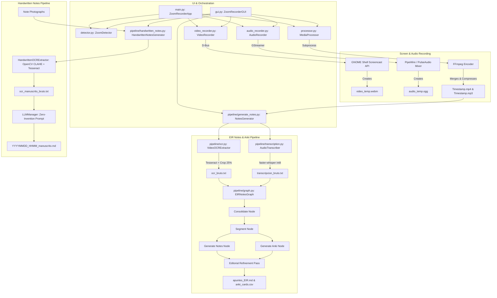

# Zoom & Screen Recorder for Linux (Wayland / GNOME) + EIR Notes & Handwritten Notes Pipeline

A lightweight, high-efficiency screen and system audio recorder for Linux (GNOME/Wayland) integrated with AI pipelines to generate structured **EIR study notes** (`apuntes_EIR.md`), **Anki flashcards** (`anki_cards.csv`), and **digitized handwritten note photographs** into Markdown with zero invention.

---

## 🎯 Project Goals & Overview

Build a multi-purpose automation utility tailored for Linux desktop environments (GNOME with Wayland or X11) such as Zorin OS or Ubuntu:

1. **High-Efficiency Screen & Audio Recorder**:
   * **Automatic Daemon Mode (Zoom)**: Silently polls system windows in the background. When it detects an active Zoom meeting window, it automatically initiates full-screen recording and mixes speaker output (and optional microphone). It saves and compresses the files once the meeting closes.
   * **Manual Recording Mode**: Immediately records full-screen video and system audio, running indefinitely until manually stopped via terminal or GTK 3 GUI.
   * **Optimized Compression**: Applies tuned H.264 parameters (10 FPS, CRF 24, stillimage tune) ensuring text, code, and presentation slides remain sharp while minimizing disk space. It also generates a standalone MP3 audio track.

2. **EIR Notes & Flashcards Generation Pipeline**:
   * **Multimodal Extraction**: Extracts text from presentation slides via Tesseract OCR and transcribes audio via `faster-whisper`.
   * **AI Orchestration (LangGraph)**: Processes recordings in 30-minute time windows through a multi-node graph (Consolidation -> Segmentation -> Parallel Generation of EIR Markdown Notes & Anki CSV Flashcards).
   * **Refinement & Anti-Hallucination**: Executes an editorial refinement pass that unifies class blocks, deduplicates flashcards, and enforces strict rules to prevent fake NANDA/NIC/NOC nursing codes or unverified medical scales.

3. **Handwritten Notes Digitization Pipeline**:
   * **Photographic Extraction**: Preprocesses handwritten note photos (CLAHE contrast enhancement, grayscale filtering via OpenCV) and performs multi-language Tesseract OCR.
   * **Zero-Invention Policy**: Strictly forbids inventing, inferring, or adding facts, definitions, or dates not present in the original photos.
   * **Faithful Graphic Rendering**: Translates handwritten layouts into Markdown with headings, bullet lists, Markdown comparison tables, LaTeX mathematical formulas ($...$), and Mermaid diagrams (```mermaid ...) for hand-drawn schemas.

4. **Voice Dictation Notes Pipeline**:
   * **Speech-to-Text Transcription**: Transcribes student voice dictation audio files (`.wav`, `.mp3`, `.flac`, `.ogg`) directly using local offline Whisper IA (`faster-whisper`).
   * **Noise & Silence Filtering**: Automatically filters out ambient background noise (FFT denoiser `afftdn` + speech bandpass 100Hz-4000Hz) and strips pauses (`silenceremove`).
   * **Ultra-Light MP3 Encoding**: Compresses speech audio down to mono 32 kbps (22.05 kHz) for minimal file size.
   * **AI Formatting & Structuring**: Cleans phonetic errors/hesitation words and structures the dictation into formatted Markdown study notes.

---

## 📑 Business and Technical Requirements

### 1. Recorder Life Cycle Automation and Control
* **Automatic Start/Stop**: Trigger recording immediately when a Zoom call starts, finalize when the call ends.
* **Graceful Interrupts**: Signal handlers (`SIGINT` / `SIGTERM` / close events) ensure cached temp data is safely merged and processed to prevent file corruption.

### 2. File Naming & Directory Organization
* Video & Audio files: Saved as `YYYYMMDD_HHMM.mp4` and `YYYYMMDD_HHMM.mp3` in `OUTPUT_DIR`.
* Study Notes & Anki Flashcards: Saved under `OUTPUT_DIR/apuntes/` (`apuntes_EIR.md` and `apuntes_EIR.docx`, `anki_cards.csv`, and raw text/docx files under `bruto/`).
* Handwritten Notes: Saved under `OUTPUT_DIR/apuntes_manuscritos/` (`YYYYMMDD_HHMM_manuscrito.md` and `YYYYMMDD_HHMM_manuscrito.docx`, and raw text/docx files under `bruto/`).
* Voice Dictation Notes: Saved under `OUTPUT_DIR/apuntes_dictados/` (`YYYYMMDD_HHMM_dictado.md` and `YYYYMMDD_HHMM_dictado.docx`, and raw text/docx files under `bruto/`).
* Automatic DOCX Export: Every generated `.md` or `.txt` file automatically generates its corresponding Word `.docx` file preserving headers, bolding, lists, and code blocks.

### 3. High Quality, Low Memory & Compression
* **Readability**: Video compression tuned for slide sharing (10 FPS, H.264 stillimage).
* **Anti-OOM Audio Chunking**: Long audio files are split into 30-minute chunks via FFmpeg stream copy to maintain RAM usage under 1 GB during Whisper transcription.

### 4. Code Architecture & Desktop Integration
* **GTK 3 Graphical Interface**: 4-Tab modular GUI for screen recording ("Grabador"), study note generation ("Apuntes EIR"), handwritten notes ("Manuscritos"), and voice dictation ("Dictado").
* **Modular OOP Design**: Decoupled Python modules under 200 lines organized in packages (`gui_components/`).
* **Credentials Security**: Sensitive LLM credentials stored in `pipeline_config.py` (excluded from version control, see `pipeline_config.py.example`).

---

## 🏗️ Architectural and Engineering Decisions



### 1. Wayland Desktop Capture Rationale
* **Decision**: GNOME Shell Screencast D-Bus API (`org.gnome.Shell.Screencast`).
* **Why**: Traditional X11 grabbers produce black screens on Wayland, while XDG Desktop Portals prompt permission popups on every launch. The GNOME Screencast D-Bus API allows silent, high-performance recording directly from the compositor.

### 2. Audio Capture and Dynamic Mixing
* **Decision**: GStreamer pipeline using `pulsesrc` and optional `audiomixer` configured dynamically via `GstDeviceMonitor`.
* **Why**: Captures system speaker output (other call participants) combined with an optional local microphone track into an Opus-compressed Ogg container.

### 3. Video Encoding Parameters (FFmpeg)
| Parameter | Value | Technical Justification |
| :--- | :--- | :--- |
| **Output FPS** | `10 fps` | Reduces frame rate to cut redundant slide frames, saving up to 70% disk space with zero loss in readability. |
| **Video Codec** | `libx264` | Maximum compatibility across all web browsers and video players. |
| **Quality (CRF)** | `24` | Dynamic bitrate allocation (stays near zero for static slides). |
| **Encoding Tune** | `stillimage` | Prevents compression artifacts around text and code on slides. |
| **Encoding Preset**| `medium` | Optimal balance between encoding speed and file size. |
| **Audio Codec (MP4)** | `AAC at 96k` | Speech-optimized audio inside the video container. |
| **Standalone MP3** | `MP3 at 128k` | High-compatibility audio file generated alongside MP4. |

### 4. OCR Slide Extraction Tuning
* **Webinar Chat Crop**: Crops the right 25% of video frames (`OCR_CROP_RIGHT = 0.25`) to prevent capturing webinar chat conversations.
* **Thumbnail Similarity Filter**: Compares a reduced 16x16 pixel thumbnail between frames; if unchanged, Tesseract execution is skipped.
* **Regex UI Cleaning**: Filters out Zoom floating controls (*"Audio Settings"*, *"Chat"*, etc.) from slide text.

### 5. Handwritten Notes Pipeline Engineering
* **OpenCV CLAHE Preprocessing**: Adaptive histogram equalization and contrast tuning to clean pen/pencil strokes on paper before OCR.
* **Zero-Invention Policy**: System prompt strictly forbids inventing, inferring, or adding facts, definitions, or dates not explicitly present in the note photographs.
* **Faithful Graphic Translation**: Converts handwritten diagrams into Mermaid blocks, handwritten tables into Markdown Tables, and mathematical formulas into LaTeX (`$...$`).

### 6. Audio Transcription (Remote Whisper API & Local faster-whisper)
* **Dual Engine**:
  * **Remote API (Default)**: Sends transcription requests directly to `https://leria.gal/api/v1/audio/transcriptions` using the same Bearer credentials as the LLM (`pipeline_config.API_KEY`). Long recordings are split into 10-minute MP3 chunks to ensure low latency, zero payload limit issues, and stable timestamps.
  * **Local Fallback**: Local `faster-whisper` execution on CPU with `int8` quantization and VAD silence filtering.
* **Instant Toggle**: Toggle between Remote API and Local Whisper anytime via the HeaderBar button (`🌐 Whisper Remoto` / `💻 Whisper Local`) or via checkboxes in the "Apuntes EIR" and "Dictado" tabs.
* **Anti-OOM Chunking**: Automatically splits long audio into manageable chunks before processing to ensure minimal RAM and network resource consumption.

---

## 📂 Project Directory Structure

The project follows a clean, modular, and decoupled Object-Oriented structure:

### Core Recorder Modules
* **[main.py](file:///home/cristina/Documentos/grabarPantalla/main.py)**: Terminal orchestrator (`ZoomRecorderApp`) for Zoom daemon polling and manual recording CLI.
* **[gui.py](file:///home/cristina/Documentos/grabarPantalla/gui.py)**: Native GTK 3 Graphical User Interface featuring 3 tabs: **Grabador** (Screen recording), **Apuntes EIR** (AI notes & Anki generation), and **Manuscritos** (Handwritten note photo digitization).
* **[install.py](file:///home/cristina/Documentos/grabarPantalla/install.py)**: Installation script configuring launcher shortcuts on Desktop and system applications menu targeting `.venv`.
* **[detector.py](file:///home/cristina/Documentos/grabarPantalla/detector.py)**: `ZoomDetector` module using `xwininfo` to detect active Zoom meeting windows.
* **[video_recorder.py](file:///home/cristina/Documentos/grabarPantalla/video_recorder.py)**: `VideoRecorder` module interacting with GNOME Shell Screencast D-Bus API.
* **[audio_recorder.py](file:///home/cristina/Documentos/grabarPantalla/audio_recorder.py)**: `AudioRecorder` module capturing and mixing microphone and speaker audio via GStreamer.
* **[processor.py](file:///home/cristina/Documentos/grabarPantalla/processor.py)**: `MediaProcessor` module executing FFmpeg for media merging, 10 FPS CRF compression, and MP3 extraction.
* **[recover.py](file:///home/cristina/Documentos/grabarPantalla/recover.py)**: Recovery script to manually merge leftover temp files if recording was interrupted.
* **[config.py](file:///home/cristina/Documentos/grabarPantalla/config.py)**: Central configuration file for recorder paths, codecs, quality, and polling timeouts.

### EIR AI Notes & Flashcards Pipeline (`pipeline/`)
* **[pipeline/generate_notes.py](file:///home/cristina/Documentos/grabarPantalla/pipeline/generate_notes.py)**: NotesGenerator orchestrator executing OCR, transcription, 30-min chunk processing, and editorial refinement.
* **[pipeline/handwritten_notes.py](file:///home/cristina/Documentos/grabarPantalla/pipeline/handwritten_notes.py)**: `HandwrittenNotesGenerator` module for digitalizing handwritten note photographs into structured Markdown files with a zero-invention policy.
* **[pipeline/ocr.py](file:///home/cristina/Documentos/grabarPantalla/pipeline/ocr.py)**: `VideoOCRExtractor` using OpenCV and Tesseract OCR with right-chat cropping and UI filtering.
* **[pipeline/transcription.py](file:///home/cristina/Documentos/grabarPantalla/pipeline/transcription.py)**: `AudioTranscriber` utilizing `faster-whisper` (int8) with anti-OOM audio chunking.
* **[pipeline/graph.py](file:///home/cristina/Documentos/grabarPantalla/pipeline/graph.py)**: LangGraph state graph defining consolidation, segmentation, and parallel note/Anki generation nodes.
* **[pipeline/llm_manager.py](file:///home/cristina/Documentos/grabarPantalla/pipeline/llm_manager.py)**: Wrapper interface for OpenAI-compatible LLM endpoints (`ChatOpenAI`).
* **[pipeline/prompts.py](file:///home/cristina/Documentos/grabarPantalla/pipeline/prompts.py)**: Centralized system prompts with anti-hallucination and zero-invention rules.
* **[pipeline_config.py.example](file:///home/cristina/Documentos/grabarPantalla/pipeline_config.py.example)**: Safe configuration template file for LLM API keys, base URLs, model selection, OCR crop parameters, and chunking limits.

### Tests
* **[test_recorder.py](file:///home/cristina/Documentos/grabarPantalla/test_recorder.py)**: Unit test suite for screen recording, window detection, and FFmpeg execution.
* **[test_pipeline.py](file:///home/cristina/Documentos/grabarPantalla/test_pipeline.py)**: Unit test suite for OCR extraction, audio transcription, LLM graph, and notes generator.
* **[test_handwritten_pipeline.py](file:///home/cristina/Documentos/grabarPantalla/test_handwritten_pipeline.py)**: Unit test suite for handwritten notes extraction and zero-invention Markdown generation.

---

## 🛠️ Prerequisites and Virtual Environment Setup

### 1. System Dependencies (Debian / Ubuntu / Zorin OS)
Install required system libraries for GNOME D-Bus, audio capture, FFmpeg, window detection, and Tesseract OCR:

```bash
sudo apt update
sudo apt install python3-dbus python3-gi gstreamer1.0-plugins-good gstreamer1.0-plugins-base gstreamer1.0-plugins-bad ffmpeg x11-utils tesseract-ocr tesseract-ocr-spa tesseract-ocr-eng xclip wl-clipboard
```

### 2. Python Virtual Environment (`.venv`)
Always use `--system-site-packages` so Python can access system GTK 3 (`gi`) and D-Bus bindings:

```bash
python3 -m venv --system-site-packages .venv
source .venv/bin/activate
```

Install Python dependencies inside `.venv`:

```bash
pip install -r requirements.txt
pip install -r pipeline/requirements_pipeline.txt
```

> **Note**: Both `gui.py`, `main.py`, and `pipeline/__init__.py` automatically detect and inject `.venv` site-packages into `sys.path`, so running scripts directly will transparently use `.venv` packages.

---

## 🖥️ Graphical User Interface (GUI) & Desktop Launcher

The native **GTK 3** application features a 3-tab window.

### 1. Install Desktop & Menu Shortcuts
Run the installer script to create desktop and application menu shortcuts configured to run under `.venv`:

```bash
python3 install.py
```

### 2. Launch the GUI
Double-click the **Zoom & Screen Recorder** icon on your desktop or run via terminal:

```bash
python3 gui.py
```

### 3. Interface Tabs
* **Tab 1: Grabador**:
  * **Select Mode**: Choose "Automatic (Detect Zoom)" to monitor calls in the background, or "Manual" for immediate full-screen capture.
  * **Record & Stop**: Click **Record** to start (timer displays `HH:MM:SS`). Click **Stop** to halt recording; compression processes asynchronously with a progress percentage bar.
* **Tab 2: Apuntes EIR**:
  * **File Selectors**: Choose video (`.mp4`) file; matching audio (`.mp3`) is automatically inferred and selected.
  * **Anki Checkbox**: Enable or disable generating study flashcards CSV.
  * **Generar Apuntes y Anki**: Starts background worker thread with real-time status updates (`OCR Extraction...`, `Transcribing Audio...`, `Executing LangGraph...`).
* **Tab 3: Manuscritos**:
  * **Photo Selector**: Choose one or multiple photographs (`.jpg`, `.png`, `.webp`...) of handwritten notes.
  * **Generar Markdown Manuscrito**: Starts background worker thread performing CLAHE OpenCV contrast enhancement, Tesseract OCR, and faithful zero-invention Markdown conversion.

---

## 🚀 Running via Terminal (CLI Mode)

### Screen & Audio Recorder CLI
Launch the recorder interactive terminal menu or use shortcuts:

```bash
# Interactive mode
python3 main.py

# Automatic Zoom Daemon direct start
python3 main.py --auto     # or -a

# Manual Full Screen Recording direct start
python3 main.py --manual   # or -m
```

### EIR Notes & Flashcards Pipeline CLI
Generate study notes directly from terminal:

```bash
# Basic usage (auto-detects matching .mp3 audio)
python3 pipeline/generate_notes.py --video /home/cristina/Documentos/Zoom/20260725_1000.mp4

# Custom audio path and skip Anki cards
python3 pipeline/generate_notes.py --video video.mp4 --audio audio.mp3 --no-anki
```

### Handwritten Notes Digitization CLI
Digitalize handwritten note photos directly from terminal:

```bash
# Specify image files directly
python3 pipeline/handwritten_notes.py --images foto1.jpg foto2.jpg foto3.jpg

# Specify a directory containing note photos
python3 pipeline/handwritten_notes.py --dir /home/cristina/Imágenes/Apuntes
```

---

## ⚙️ Custom Configurations

### 1. Screen Recorder Configuration (`config.py`)
Edit [config.py](file:///home/cristina/Documentos/grabarPantalla/config.py) to set video output directories, frame rates, and audio parameters:

```python
OUTPUT_DIR = "/home/cristina/Documentos/Zoom"
VIDEO_FRAMERATE = 10
VIDEO_CRF = 24
VIDEO_PRESET = "medium"
AUDIO_SYNC_OFFSET = 0.2
RECORD_MICROPHONE = False
```

### 2. Pipeline Configuration (`pipeline_config.py`)
Copy [pipeline_config.py.example](file:///home/cristina/Documentos/grabarPantalla/pipeline_config.py.example) to `pipeline_config.py` and set your credentials:

```python
cp pipeline_config.py.example pipeline_config.py
```

Edit `pipeline_config.py`:

```python
API_BASE_URL = "https://leria.gal/api"
API_KEY = "your-api-key"
MODEL_NAME = "leria:redacta"

OCR_CROP_RIGHT = 0.25      # Crop right 25% of screen (ignores Zoom chat)
OCR_CHUNK_MINUTES = 30     # Process long classes in 30-min windows
USE_REMOTE_WHISPER = True  # Use remote Whisper API endpoint by default (True/False)
WHISPER_ENDPOINT = "https://leria.gal/api/v1/audio/transcriptions"
WHISPER_MODEL = "base"     # Local Whisper model size ('tiny', 'base', 'small', 'medium')
GENERATE_ANKI = True       # Enable Anki generation by default
```

---

## 🧪 Running Unit Tests & Quality Audits

Run the full pytest suite, security audit (Bandit), and PEP 8 linting (Flake8):

```bash
# 1. Run unit test suite (15 tests)
.venv/bin/pytest

# 2. Run Bandit static security audit
.venv/bin/bandit -r . -x ./.venv,./.temp,./__pycache__,pipeline/__pycache__ -ll

# 3. Check PEP 8 code formatting
.venv/bin/flake8 . --exclude=.venv,.temp,__pycache__,pipeline/__pycache__ --max-line-length=120
```

See [TESTING_AND_QUALITY_RULES.md](file:///home/cristina/Documentos/grabarPantalla/TESTING_AND_QUALITY_RULES.md) and [.cursorrules](file:///home/cristina/Documentos/grabarPantalla/.cursorrules) for detailed project testing, security, and PEP 8 guidelines.

---

## 📄 License

This project is licensed under the **MIT License**. See [LICENSE](file:///home/cristina/Documentos/grabarPantalla/LICENSE) for legal terms.
